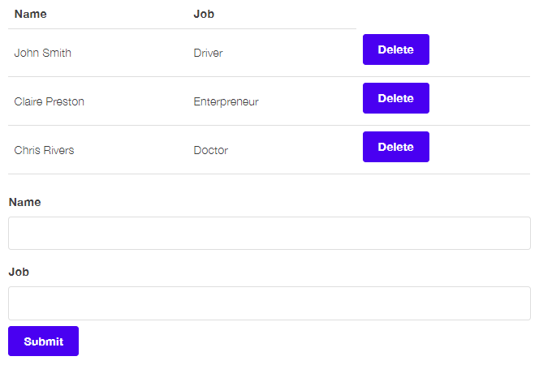

# React Form Practice

Practice to understand React core principles, such as:

- JSX
- Class components
- Function components
- Props
- State
- Interactions
  - Component creation
  - Component deletion

## Form layout outcome

Records can be dinamically added/deketed to the table by the user.

## Running the code

Clone the repository and run it with the two commands below:

> **git clone repository-url**

> **yarn start**

_If you want to build it from scratch, step-by-step, please check Tania Rascia's blog post on [this link](https://www.taniarascia.com/getting-started-with-react/)._
